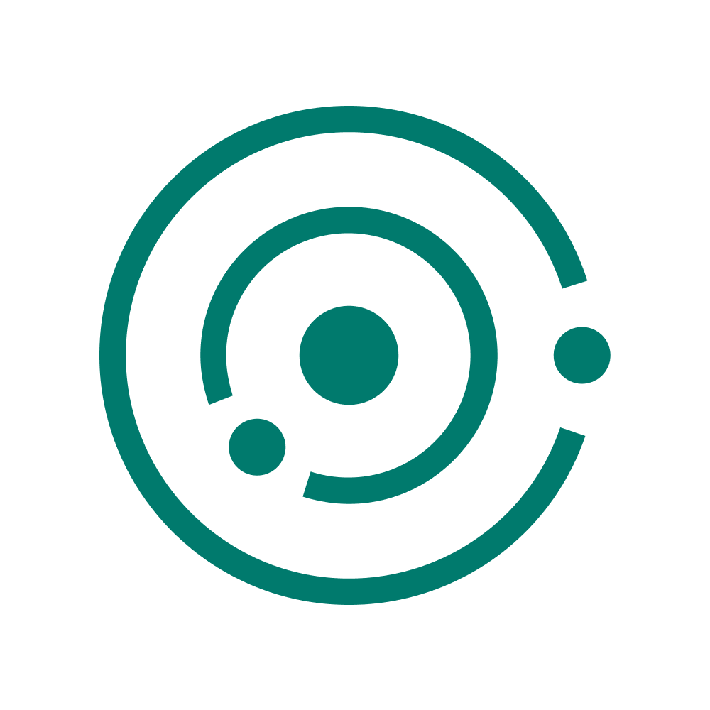

  

<h1 align="left">Proponent: Sales Enablement that makes everyone a product expert</h1>

  <a href="#features">Features</a> •
  <a href="#key-differentiation">Key Differentiation</a> •
  <a href="#project-status">Project Status</a> •
  <a href="#contributing">Contributing</a> •
  <a href="#license">License</a> •
  <a href="#contact">Contact</a>

---

Proponent is an innovative sales enablement tool that harnesses the power of artificial intelligence to create hyper-personalized selling experiences for each customer. By leveraging natural language processing on customer communication and engagement signals, Proponent continuously improves its understanding of customer priorities and generates tailored messaging and content across various sales and marketing channels.

## Features

- Personalized email sequences for outbound campaigns based on customer priorities
- Dynamic landing pages with content matched to specific pain points
- Customized sales collateral addressing individual use cases
- Continuous learning from customer interactions to refine understanding of their needs
- Seamless integration with multiple sales and marketing channels

## Project Status

Please note that Proponent is currently under active development and may not be fully ready for deployment yet. We are working diligently to refine the features, improve the codebase, and ensure a seamless user experience. Stay tuned for updates on the project's progress and future release plans.

## License

This project is licensed under the [Apache License 2.0](LICENSE).

## Contact

If you have any questions, suggestions, or feedback, please feel free to reach out at [pmohite95@gmail.com](mailto:pmohite95@gmail.com).
